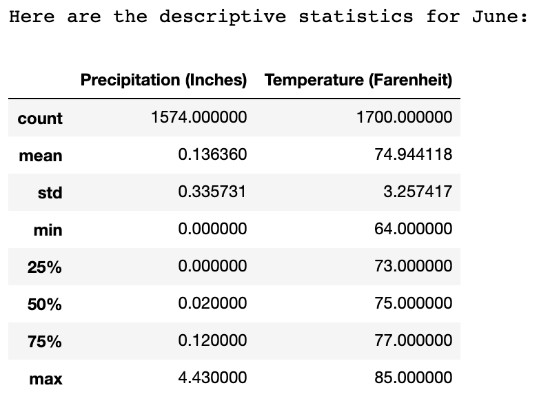
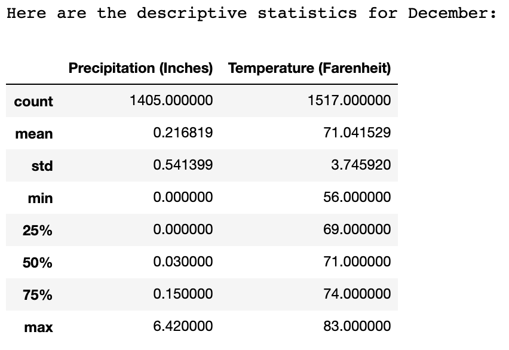

# Surfs Up
UC Berkeley Extension Data Analytics Boot Camp Module 9
---

### Objective:

In the Challenge Assignment, we were asked to compare the weather observed in June and December to help determine the viability of our Surf Shop. After doing so, we were asked to provide a couple recommendations to improve our analysis.

---

### Results:

---

### Analysis - Comparing June to December:

#### Here are some key differences between June and December:

##### Precipitation:

- We can see that June had, on average, less rainfall than December (0.14" vs. 0.22")
- The maximum rainfall recorded in June is also lower than that in December (4.43" vs. 6.42")
- The standard deviation of precipitation values in June is smaller than the standard deviation in December. This indicates that the spread of the datapoints is smaller in June, which we can assume to mean that there are more predictable weather patterns in June than in December.

##### Temperature:

- We can see that the average temperature in June is higher than that of December (74.94 deg vs. 71.04 deg)
- The minimum temperature in June is also higher than that of December (64 deg vs. 56 deg)
- The maximum temperature in June is higher than that in December as well (85 deg vs. 83 deg)
- While the average and maximum temperatures for both June and December are both pleasant for surfing, we can assume that June is a better time to surf, as the minimum temperature is significantly higher than that in December, and the spread of temperature values (denoted by the higher standard deviation) is greater in December.

##### Overall Analysis:

- While both June and December have days of suitable surfing weather, we can expect that our surfing business will be busier in the summer months than in the winter months due to more predictable weather with higher temperatures that will make surfing an appealing activity.
- Fortunately, the fact that there are still suitable surfing days in December means that the business can continue to make profits year-round, even if there may be fluctuations in the profitability based on the season.

---

### Recommendations:

#### In order to improve our analysis, here are some other metrics we could look at:

- We could calculate the number of days in each month that there was any precipitation. This would allow us to see which months had a higher percentage of days that had precipitation, and allow us to plan for those months to be less profitable than others. For example, if we find that it rains most of the days in April, we could choose to run promotions on the days where it does not rain, to attract customers and incentivize them to go surfing when they otherwise might not have thought about it.

- We could define an optimal range of temperatures for surfing, and calculate the number of days in each month where the high and low recorded temperatures fell within that range. This would allow us to see which months are the most appealing for surfing, and allow us to plan our advertising and resources appropriately. 
